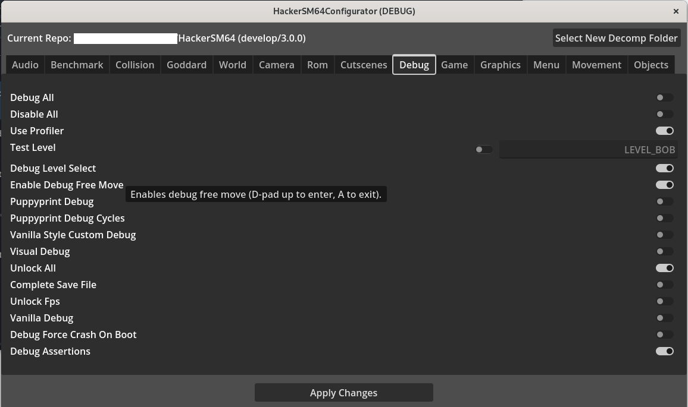

# HackerSM64 Configurator

A Godot Project that streamlines the [HackerSM64](https://github.com/HackerN64/HackerSM64) repo configuration process.

## Features
 - Configure any HackerSM64 repository in one place (Theoretically forwards-compatible too)
 - Non-destructive
   - If `Apply Changes` is pressed and no actual changes were made in the program, only 29 extra whitespace characters are removed on a vanilla repo
 - Intuitive UI controls
 - Dropdowns for select configs
 - Remembers your repo folder
 - Hover over a control to view a description of its functionality

## TODOs
 - Make descriptions work fully (and fit the screen lol)
 - Utilize config_safeguards.h to automatically toggle/disable relevant entries
 - Figure out scrollbar layouts (They work but are displayed nowhere near correctly)
 - Make the app look pretty and themed and whatnot (hi godot devs 🙂)
   - This also entails making the UI compliant to some legibility standard because the current UI is hard to follow horizontally
